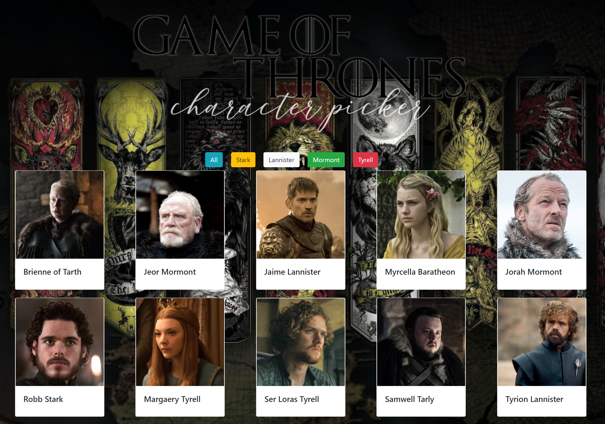
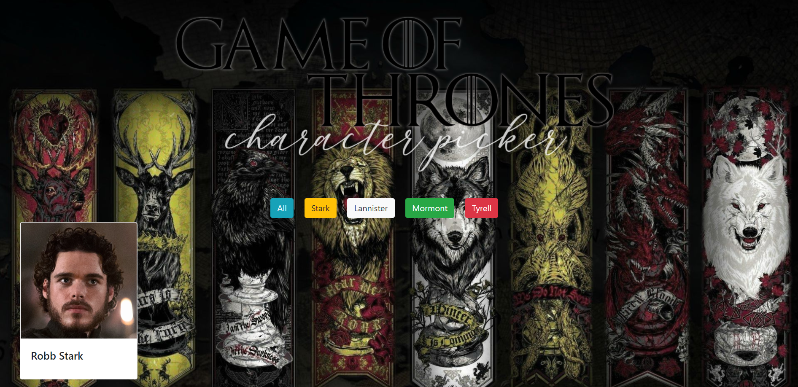
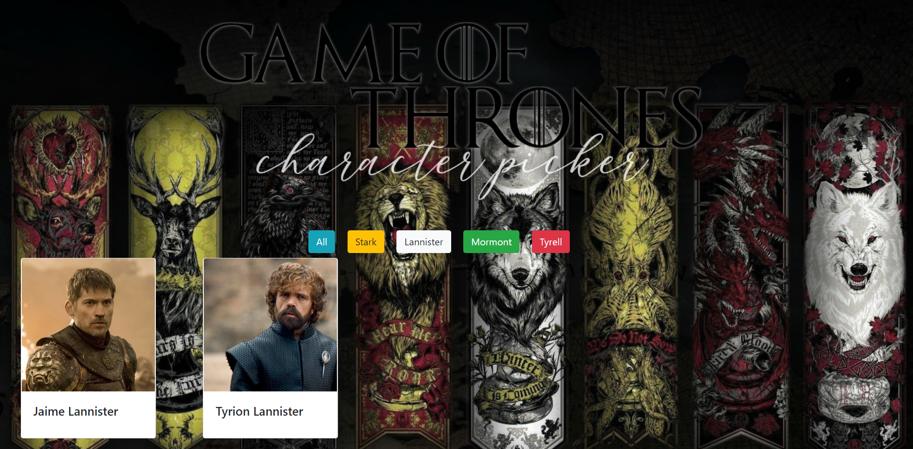

# Game of Thrones

Game of Thrones, what a show right? There are an unbelievable amount of characters and houses that represent the people of Westeros, Essos, Dome, The Riverlands... and so on. Wouldn't it be nice to click on a house and have all of the characters within that house appear? Granted I don't have every character on the website, but I'm working on it. Click a button that was created by an event listener (good 'ol clicker), tied back to a function that targeted a character id's to sort through (or find) the closest related house. Click on the actual character and everyone else disappears that you don't really want to see. Bannishment! The character's photo will enlargen and you will see their name and house. Tired of staring at their face? Click the red x button in the top left corner that was created by using another click event listener that called this cool function that tied back to this data page where I wrote this insanely long named function that did some fun JSON.parsing from my characters page. Yes, my JSON page that I have all my characters in that will continue to over flow. Perhaps even descriptions will also appear over time with the character. But let's not get hasty. This was another project that helped us use modules, which I found to be good practice. We used the JSON page, like in the adoption page, which held all of our information, tying back to a private variable. I put a cool GoT background behind with the main houses and I made a quick banner to give it a little more pizazz. Enjoy! 

## Screenshot







## How to run this project
* Use npm to install http-server in your terminal:
```sh
npm install -g http-server
```
* Run the server:
```sh
hs -p 9999
```
* Open Chrome and navigate to 
```
localhost:9999
``` 
